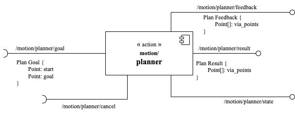
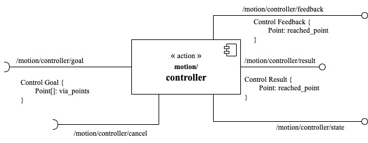
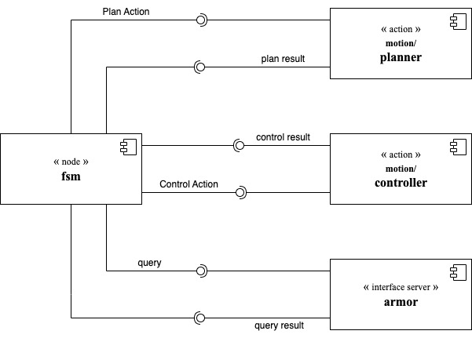

# EXPROBLAB_Assignment1

##  Introduction
The assignment is the realization of an algorithm to make the robot move in an environment and have a surveillance behaviour to choose the way to move. The invironment is composed of locations that are connected in a certain way depending on the choice of the user.
The goal is to build a Finite State Machine (FSM) that allows the robot to choose the behaviour to adopt depending on the situation. The robot is also provided a battery, periodically checked, that needs to be recharged after some time of using. <br>
The locations are divided into:
* room: location with one door;
* corridor: location with at least two door.

The entities that connect two locations are called _doors_ and the entity that moves in the environment is the robot, called _Robot1_.

##  Folder organization
This repository contains a ROS package named `EXPROBLAB_Assignment1` that includes the following resources.
 - [CMakeLists.txt](CMakeLists.txt): File to configure this package.
 - [package.xml](package.xml): File to configure this package.
 - [setup.py](setup.py): File to `import` python modules from the `utilities` folder into the 
   files in the `script` folder. 
 - [launch/](launch/): Contains the configuration to launch this package.
    - [assignment.launch](/launch/assignment.launch)
 - [msg/](msg/): It contains the message exchanged through ROS topics.
    - [Point.msg](msg/Point.msg): It is the message representing a 2D point.
 - [action/](action/): It contains the definition of each action server used by this software.
    - [Plan.action](action/Plan.action): It defines the goal, feedback and results concerning 
      motion planning.
    - [Control.action](action/Control.action): It defines the goal, feedback and results 
      concerning motion controlling.
 - [scripts/](scripts/): It contains the implementation of each software components.
    - [speech.py](scripts/speech.py): It is a dummy implementation of the speech-based 
      commands detection algorithm.
    - [gesture.py](scripts/gesture.py): It is a dummy implementation of the gesture-based
      commands detection algorithm.
    - [robot_state.py](scripts/robot_state.py): It implements the robot state including:
      current position, and battery level.
    - [planner.py](scripts/planner.py): It is a dummy implementation of a motion planner.
    - [controller.py](scripts/controller.py): It is a dummy implementation of a motion 
      controller.
 - [utilities/EXPROBLAB_Assignment1/](utilities/EXPROBLAB_Assignment1/): It contains auxiliary python files, 
   which are exploited by the files in the `scripts` folder.
    - [name_mapper.py](utilities/EXPROBLAB_Assignment1//name_mapper.py): It contains the name
      of each *node*, *topic*, *server*, *actions* and *parameters* used in this architecture, if any.
 - [docs/](docs/): It contains the _HTML_ documentation of the package.
 - [topology/](/topology): It contains the starting ontology used in the package which is modified in the initial state to build the new environment for the assignment.
    - [topological_map.owl](topology/topological_map.owl): topological map from which the environment is built.
 - [images/](images/): It contains the diagrams and images shown in this README file.

##  Software Architecture
The main software, the one of the Finite State Machine is composed of four states:
* [_Init State_](scripts/init_state.py);
* [_Reasoner State_](scripts/reasoner.py);
* _Move Random State_;
* [_Recharge State_](scripts/recharge.py).

This structure can be seen by the following image:


Where the _Move Random State_ represents a sub finite state machine, which means that it is composed in turn of other states, in particular:
* [Plan Path To Location State](scripts/plan_path_to_location.py);
* [Go To Location To Visit State](scripts/go_to_location_to_visit.py).

The graph above is taken from the automatic SMACH viewer and by purpose it does not include all the transitions of the states (to make it more readable). In order to evaluate the entire graph correctly and see all the transitions clearly we provided one by drawing it and highlighting the transitions in a better way. <br>
<br>
In order to retrieve the automatic viewer from ros

```bash
rosrun smach_viewer smach_viewer.py
```

The hand-drawn graph can be seen in the following image:


Here all the transitions can be clearly read and it is highlighted also the sub finite state machine used with the two inner states in details.

###  Software components
It follows the details of the software components used in the program, which are available in the [`scripts`](scripts/) folder.

#### The `planner` Node

	
The [`planner`](scripts/planner.py) node implements an action server called `motion/planner`. This is done by the means of the `SimpleActionServer` class based on the `Plan` action message. This action server requires a `start` and a `target` position passed as two fields of the goal. <br>
Given the goal parameters this component return a plan as a list of `via_points`, which are computed by spacing linearly the distance between the two _x_ and _y_ coordinates of the points. The number of `via_points` can be modified thanks to the parameter in the [`name_mapper.py`](utilities/EXPROBLAB_Assignment1/name_mapper.py) file. <br>
When a new `via_points` is generated, the updated plan is provided as `feedback`. When all the `via_points` have been generated, the plan is provided as `results`.

#### The `controller` Node

	
The [`controller`](scripts/controller.py) node implements an action server named `motion/controller`. This is done by the means of the `SimpleActionServer` class based on the `Control` action message. This action server requires the `plan` given as a list of `via_points` by the planner.<br>
Given the plan the `controller` iterates for each planned `via_points` and waits to simulate the time spent to move the robot. <br>
Each time a `via_point` is reached the a `feedback` is provided. When the last `via_point` is reached, the action service provides a `result` by propagating the current robot position.

The program starts in the _Init State_ which initializes the ontology (the environmemt). Then this state is no longer executed. The program passes to the _Reasoner State_ which reasons the changes:
* the actual robot position;
* the timestamps representing the last time a location has been visited by the robot.

The FSM enter now the sub-FSM, which first computes a path from the actual location of the robot to a reachable location and then moves the robot to that location. <br>
The loop of _Reasoner_ - _Plan Path_ - _Go To Location_ is repeated in an infinite loop until the robot gets a stimulus:
* _battery low_: which means that the robot needs to be recharged. To do so, the robot is firstly driven to the dedicated location and then is recharged. At the end it starts again the loop;
* _urgent location_: after some time a location is not visited by the robot it becomes urgent and if the robot can reach it by its actual position it has to go there.
<br>

The code is also composed of an _Helper_ which is a class containing all the shared variables and the mutex to allow the FSM states access them correctly. This class also manages the initialization and the share of the clinents for the respective servers.



In teh figure above there is the presentation of how the components used in the software interact among them. In particular:
* _armor server_: it is the server used to provide the computations related to the ontology. It communicates through queries that are sent from the Finite State Machine to the server and this in turn gives a result then analyzed in the FSM.
* _planner_: it is responsible of computing the path and communicates through the _Plan Action_ sent. It returns a plan which is the result of the server.
* _controller_: it is responsible of moving the robot along the path and communicates through the _Control Action_ sent. It updates the actual position of the robot through the via points thanks to the server result.

##  Installation and Running Procedure
### Run by `roslaunch` file
In order to run the program by the [`roslaunch`](launch/assignment.launch) file we first need to install the `xterm` tool by following these steps:
```bash
sudo apt-get update
sudo apt-get -y install xterm
```

Now to run the code we just type these on a terminal:
```bash
roslaunch EXPROBLAB_Assignment1 assignment.launch
```

### Run each single node manually
In order to run the code without using the `roslaunch`:
```bash
roscore &

# Terminal A: aRMOR Server
rosrun armor execute it.emarolab.armor.ARMORMainService

# Terminal B: Planner Server
rosrun EXPROBLAB_Assignment1 planner.py

# Terminal C: Controller Server
rosrun EXPROBLAB_Assignment1 controller.py

# Terminal D: FSM node
rosrun EXPROBLAB_Assignment1 fsm.py
```

##   Video
The video below represents a part of the program during its normal execution.
As the video starts there are four sections in the window:
* top-left: it is the aRMOR Server window and it is used to make the query and communicate with the FSM program;
* top-right: it is the FSM node. Here the program shows its log messages and it is the one that has to be read to better understand the program execution. <br>
It shows us which state the FSM is into, what it is doing into ithe state and the changing action that provides the pass from one state to another;
* bottom-left: it is the planner server that computes the path from the start postion to the target one and publish the result;
* bottom-right: it is the controller server that simualtes the movement of the robot by changing its position through the points of the path.

Here there is the gif:


The video begins with the starting of all the points, then the FSM enters in the _PlanPathToPostion_ so the planner publishes the result. Then it goes in the _GoToLocationToVisit_ state and controller server moves the robot. In the new location the robot waits for some instants, defined as a parameter in the  file as 5 seconds, and then the FSM reasons the changes in the ontology through the `reasoner` state: where it is and which lcoation it can now reach. <br>
After that, it plans again and starts moving randomly again. <br>
The robot has also to reach some urgent locations that in the video are the possible rooms _Rn_ that are shown as destination while it is in the corridors. Once visited the robot return to the corridor and goes on with its behaviour. <br>
Just as a video simulation, the autonomy of the battery is set to 15 seconds and the urgent parameter for the location to 5 seconds.

#### Surveillance Policy adopted
When the robot’s battery is not low, it should move among locations with this policy: 
* it has to stay mainly in the corridors: _E_, _C1_ and _C2_ in this case;
* if a reachable location has not been visited for some times, which means that it has become _urgent_, then is has to go there immediately.

In the video the urgent location is the _X_ one. The robot then move to the corridor again since it is the only location reachable from that room in this particular ontology. <br>
The FSM is then brought to execute the _Recharge_ state, so the robot is firstly driven to this location, _E_ and then it is recharged (as it can be read from the comments in the video). <br>
Just as a video demonstration the battery is set to need a recharge after 15 seconds of execution so that the user can see how the robot behaves in case of battery low. <br>
The normal autonomy of the battery is set to one minute of program execution, after which the robot has to recharge to go on with its surveillance behaviour.

##  Working Hypothesis and Environment
### Environment
The ontology that we initialized in this assignment is the following:


The environment used and initialized is supposed to be consinstent with the real one, so that the reasoner can always find a consinstent ontology to work on. <br>
Moreover, it is also assumed that all corridors, _E_, _C1_ and _C2_ are connected together. In this way the robot is able to perform its _surveillance policy_ correctly. <br>
Also for more difficult environment, so for bigger ontologies it is assumed that all the corridors are connected together and at least with the _recharging location_. <br>
It was also assumed that each location is associated to a spicific coordinate point composed of _x_ and _y_ value. These are the values that are used in the `planner` to compute the path. The values of the coordinates are taken from the [`name_mapper.py`](utilities/EXPROBLAB_Assignment1/name_mapper.py) file and are also shown in the figure above. Of course it is not taken into account the actual dimension of the environment, but they are just used to have a reference for the path computation. <br>
<br>
The _urgent_ parameter that allows the location to have the priority to be visited is set to 15 seconds. All the location that have not been visited for more than 15 seconds become urgent and have the priority. Of course, if the robot has not enough battery the priority is taken by the recharging room _E_ that is the one to be reached as soon as possible.

### Robot
The robot starts in the _Recharging Room_ which is in this case the _E_ one. From here it move randomly, which means that it checks the reachable location from its actual one and then chooses randomly among the list of possibilities. <br>
The robot is also assumed to have an autonomy of 60 seconds, after which it needs to be recharged. It is assumed that the robot needs to reach the proper location before being recharged and also this reaching transition is performed randomly at the beginning when the robot cannot reach the recharging location; as soon as it has the possibility to reach it, then the choice is imposed to this one. <br>
The robot has an autonomy battery of 60 seconds after which it has to be recharged before continuing with its normal behaviour.

### System Features
In order to build the system it was opted to build a robust code. In fact, when the robot has a low battery level its only goal is to reach the _E_ room: as it was more than an _urgent_ location. This means that the robot could move around for a high amount of time if it did not detect the recharing room immediately, but this behaviour would not affect neither the surveillance problem of the robot nor the physical constraints: the robot could not be teletransported from a room to another so need to have the physical possibility to reach that new location.

### System Limitation
One of the possible limitation of the code is the possibility of having the robot moving randomly for a long time before reaching the recharging room when needed which could be tricky from a physical point of view since the robot could not have all that amount of battery left. Howeverm this approach is preferred with respect to another one since it is robuster and respects the physics behind the robot movement.

### Possible technical improvements
A possible improvement could be the possibility to make the robot remember a path from each location to the recharging room so that in case of low battery it can reach the location without having to choose randomly and thus reducing the time wasting due to the random choice. <br>
Moreover, if the robot had to compute the path it would have to compute it by checking all the possible paths and take the most optimal one thus avoiding loosing time with not useful movements and not have to waste important battery.

##  Authors and Contacts
[Matteo Maragliano](https://github.com/mmatteo-hub) (S4636216) <br>
[S4636216@studenti.unige.it](mailto:S4636216@studenti.unige.it)
